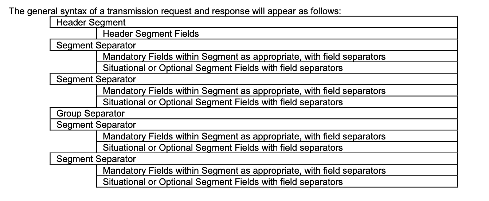

# poc-ncpdp-parser-java

This project is a Java 21 application managed with Gradle.

## Purpose

The purpose of this project is to implement a NCPDP Telecommunication Standard (NCPDP) parser.
The parser should be able to read and parse NCPDP files, extract relevant data, and provide methods to access the parsed information.
The NCPDP standard is a set of guidelines for electronic healthcare transactions, and the parser should be able to handle the D0 version of the standard.

## Getting Started

- To build the project: `./gradlew build`
- To run tests: `./gradlew test`

## Project Structure
- `src/main/java` - Main Java source code
- `src/test/java` - Unit tests

## Using the Parser

The main entry point for interacting with this library is the `Parser` class. The `Parser` provides methods to parse a raw NCPDP Transmission and return structured Java objects representing the contents of those files. Depending on your needs, you can choose to work with either the domain model objects (`Request`, `Response`) or their corresponding Data Transfer Objects (`RequestDTO`, `ResponseDTO`).

### Four Ways to Parse

- **Request**:  
  Use `Parser.parseRequest(String rawContent)` to parse a request file and get a `Request` object, which provides access to the header, transmission group, and transaction groups.

- **Response**:  
  Use `Parser.parseResponse(String rawContent)` to parse a response file and get a `Response` object, which provides access to the header, transmission group, and transaction groups.

- **RequestDTO**:  
  Use `Parser.parseRequestIntoDTO(String rawContent)` to parse a request file and get a `RequestDTO` object, which is a simplified, serializable representation suitable for APIs or external systems.

- **ResponseDTO**:  
  Use `Parser.parseResponseIntoDTO(String rawContent)` to parse a response file and get a `ResponseDTO` object, which is a simplified, serializable representation suitable for APIs or external systems.

## Using the Builder
The `Builder` interface provides static utility methods for constructing NCPDP transmission strings from DTO objects. These methods are useful when you need to serialize structured Java objects back into the NCPDP transmission format.

### Public Methods

- **`Builder.buildRequest(RequestDTO request)`**  
  Builds a request transmission string in ASCII (7-bit) encoding from a `RequestDTO` object. This includes formatting the request header, transmission group, and transaction groups according to the NCPDP standard.

- **`Builder.buildResponse(ResponseDTO response)`**  
  Builds a response transmission string in ASCII (7-bit) encoding from a `ResponseDTO` object. This includes formatting the response header, transmission group, and transaction groups according to the NCPDP standard.

Both methods ensure the correct order and formatting of segments and groups as required by the NCPDP Telecommunication Standard. If a segment builder cannot be found for a DTO, an `IllegalArgumentException` is thrown.

## NCPDP Syntax



### ORDER OF SEGMENTS
At the Transmission request level, the Transaction Header Segment must appear first. The Patient Segment and Insurance Segment can be
submitted in either order, if both appear, regardless of whether they are mandatory, situational, or optional segments. At the Transaction
request level, the Group Separator occurs, and then the other segments may occur in any order. Note the Segments must occur only once
and according to the rules for that transaction.

At the Transmission response level, the Response Header Segment must appear first. The Response Message Segment and Response
Insurance Segment may occur in either order, if both appear, regardless of whether they are mandatory, situational, or optional segments. At
the Transaction response level, the Group Separator occurs, and then the Response Status Segment through Response Coordination of
Benefits/Other Payers Segment may occur in any order. Note the Segments must occur only once and according to the rules for that
transaction.

The receiver must not force an order of segments.
The general structure of a request, for most transactions, will appear as follows (recognizing that some segments may not be used for a given
transaction):
- Transmission
- Header Segment
- Patient Segment
- Insurance Segment
- Transactions (up to four per transmission)
- Claim Segment
- Pharmacy Provider Segment
- Prescriber Segment
- Coordination of Benefits/Other Payments Segment
- Workers’ Compensation Segment
- DUR/PPS Segment
- Pricing Segment
- Coupon Segment
- Compound Segment
- Prior Authorization Segment
- Clinical Segment
- Additional Documentation Segment
- Facility Segment
- Narrative Segment

The general structure of a response, for most transactions, will appear as follows (recognizing that some segments may not be used for a
given transaction):

- Response
- Response Header Segment
- Response Message Segment
- Response Insurance Segment
- Transaction Response (up to four per transmission)
- Response Status Segment
- Response Claim Segment
- Response Pricing Segment
- Response DUR/PPS Segment
- Response Prior Authorization Segment
- Response Coordination of Benefits/Other Payers Segment

### More Details
Refer to Chapter ```33. STANDARD CONVENTIONS``` of the Telecommunications Implmentation Guide for more details on structure and conventions used in the standard. 